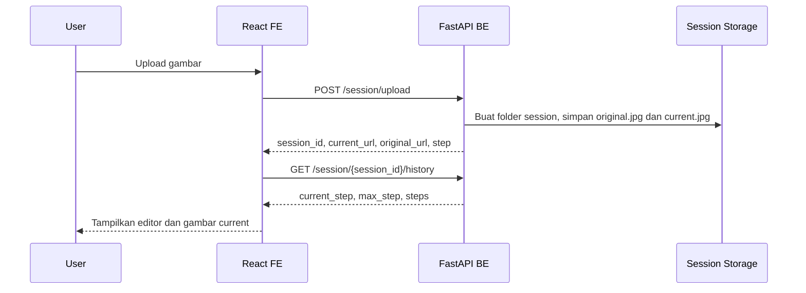
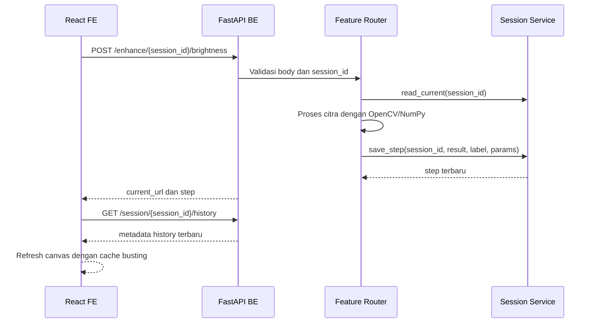

# TNA Backend

Backend ini menyediakan REST API untuk aplikasi Mini Photoshop / TNA. API dibangun dengan FastAPI dan memproses citra menggunakan OpenCV, Pillow, NumPy, Matplotlib, serta TensorFlow untuk fitur pengenalan objek.

## Fitur Utama

- Upload gambar dan membuat session pengolahan citra.
- Menyimpan gambar original, gambar current, dan riwayat perubahan.
- Undo, redo, reset, jump ke step tertentu, dan delete session.
- Operasi enhancement, geometric transform, restoration, binary/edge, color processing, segmentation, compression, histogram, dan ML recognition.
- Dokumentasi API otomatis melalui Swagger UI dari FastAPI.

## Tech Stack

- Python
- FastAPI
- Uvicorn
- OpenCV
- Pillow
- NumPy
- Matplotlib
- TensorFlow

## Struktur Folder

```text
TNA-BE/
|-- main.py                  # Entry point FastAPI dan registrasi router
|-- config.py                # Konfigurasi session, upload, history, dan model
|-- requirements.txt         # Dependency Python
|-- models/                  # Lokasi model CNN, misalnya cnn_model.h5
|-- routers/                 # Kumpulan endpoint berdasarkan fitur
|-- services/                # Logic session, ML, dan helper image
`-- README.md
```

## Cara Setup Aplikasi

Pastikan Python sudah terpasang. Disarankan menggunakan Python 3.10 atau lebih baru.

1. Masuk ke folder backend.

```bash
cd TNA-BE
```

2. Buat virtual environment.

```bash
python -m venv .venv
```

3. Aktifkan virtual environment.

Windows PowerShell:

```bash
.\.venv\Scripts\Activate.ps1
```

Command Prompt:

```bash
.\.venv\Scripts\activate.bat
```

Linux/macOS:

```bash
source .venv/bin/activate
```

4. Install dependency.

```bash
pip install -r requirements.txt
```

5. Pastikan file model tersedia jika ingin memakai fitur ML recognition.

```text
models/cnn_model.h5
```

6. Jalankan server.

```bash
uvicorn main:app --reload --host 0.0.0.0 --port 8000
```

7. Cek backend.

- Health check: `http://localhost:8000/`
- Swagger docs: `http://localhost:8000/docs`
- ReDoc: `http://localhost:8000/redoc`

## Konfigurasi

Konfigurasi utama ada di `config.py`.

| Konfigurasi | Fungsi |
| --- | --- |
| `SESSION_DIR` | Folder temporary untuk menyimpan session gambar. Default mengikuti env `TEMP` atau `/tmp/mini-photoshop`. |
| `ALLOWED_EXTENSIONS` | Format upload yang diterima: `jpg`, `jpeg`, `png`, `bmp`. |
| `MAX_HISTORY_STEPS` | Batas jumlah history step, default `20`. |
| `CNN_MODEL_PATH` | Path model CNN: `models/cnn_model.h5`. |
| `CNN_INPUT_SIZE` | Ukuran input model, default `(224, 224)`. |
| `CNN_TARGET_CLASS` | Target class ML recognition. |

## Dokumentasi API

Base URL default:

```text
http://localhost:8000
```

### Response Umum Operasi Gambar

Sebagian besar endpoint proses gambar mengembalikan format seperti berikut.

```json
{
  "success": true,
  "session_id": "uuid-session",
  "current_url": "/sessions/uuid-session/current",
  "step": 1,
  "message": "Operation applied successfully."
}
```

FE menggunakan `current_url` untuk reload gambar terbaru dan `step` untuk sinkronisasi history.

### Error Umum

Format error dapat berupa string bawaan FastAPI atau object seperti berikut.

```json
{
  "detail": {
    "success": false,
    "error": "Session not found.",
    "code": "SESSION_NOT_FOUND"
  }
}
```

### Session dan Image Management

| Method | Endpoint | Body | Fungsi |
| --- | --- | --- | --- |
| `GET` | `/` | - | Health check backend. |
| `POST` | `/session/upload` | `multipart/form-data` field `file` | Upload gambar dan membuat session baru. |
| `POST` | `/session/{session_id}/reset` | - | Reset gambar ke original dan hapus history. |
| `POST` | `/session/{session_id}/undo` | - | Mundur satu step history. |
| `POST` | `/session/{session_id}/redo` | - | Maju satu step history. |
| `POST` | `/session/{session_id}/jump` | `{ "step": 2 }` | Pindah ke step history tertentu. |
| `GET` | `/session/{session_id}/history` | - | Ambil metadata history. |
| `DELETE` | `/session/{session_id}` | - | Hapus session. |
| `GET` | `/sessions/{session_id}/current` | - | Serve gambar current. |
| `GET` | `/sessions/{session_id}/original` | - | Serve gambar original. |
| `POST` | `/image/{session_id}/save` | `{ "filename": "...", "format": "jpg", "quality": 90 }` | Download/simpan hasil gambar. |

Contoh upload:

```bash
curl -X POST http://localhost:8000/session/upload \
  -F "file=@sample.jpg"
```

### Enhancement

| Method | Endpoint | Body |
| --- | --- | --- |
| `POST` | `/enhance/{session_id}/brightness` | `{ "value": 25 }` |
| `POST` | `/enhance/{session_id}/contrast` | `{ "value": 1.5 }` |
| `POST` | `/enhance/{session_id}/histogram-equalization` | - |
| `POST` | `/enhance/{session_id}/sharpen` | `{ "intensity": 1.0 }` |
| `POST` | `/enhance/{session_id}/smooth` | `{ "kernel_size": 5 }` |

### Geometric Transform

| Method | Endpoint | Body |
| --- | --- | --- |
| `POST` | `/geometric/{session_id}/rotate` | `{ "angle": 90, "expand": true }` |
| `POST` | `/geometric/{session_id}/flip` | `{ "direction": "horizontal" }` |
| `POST` | `/geometric/{session_id}/crop` | `{ "x": 0, "y": 0, "width": 200, "height": 200 }` |
| `POST` | `/geometric/{session_id}/resize` | `{ "width": 800, "height": 600, "interpolation": "bilinear" }` |
| `POST` | `/geometric/{session_id}/translate` | `{ "tx": 20, "ty": 10 }` |

### Restoration

| Method | Endpoint | Body |
| --- | --- | --- |
| `POST` | `/restoration/{session_id}/gaussian-blur` | `{ "kernel_size": 5, "sigma": 1.0 }` |
| `POST` | `/restoration/{session_id}/median-filter` | `{ "kernel_size": 5 }` |
| `POST` | `/restoration/{session_id}/noise-removal` | `{ "noise_type": "salt_pepper", "strength": 10 }` |

### Binary, Edge, Color, dan Segmentation

| Method | Endpoint | Body |
| --- | --- | --- |
| `POST` | `/binary-edge/{session_id}/threshold` | `{ "value": 127, "mode": "binary" }` |
| `POST` | `/binary-edge/{session_id}/edge-detection` | `{ "method": "canny" }` |
| `POST` | `/binary-edge/{session_id}/morphology` | `{ "operation": "erosion", "kernel_size": 3, "iterations": 1 }` |
| `POST` | `/color/{session_id}/to-grayscale` | - |
| `POST` | `/color/{session_id}/split-channels` | `{ "channel": "R" }` |
| `POST` | `/color/{session_id}/adjust-hue-saturation` | `{ "hue_shift": 10, "saturation_scale": 1.2 }` |
| `GET` | `/color/{session_id}/channel-preview?channel=R` | - |
| `POST` | `/segmentation/{session_id}/threshold-based` | `{ "threshold": 127, "mode": "binary" }` |
| `POST` | `/segmentation/{session_id}/edge-based` | `{ "threshold1": 50, "threshold2": 150 }` |
| `POST` | `/segmentation/{session_id}/region-based` | `{ "num_clusters": 3 }` |

### Compression, Histogram, dan ML

| Method | Endpoint | Body | Fungsi |
| --- | --- | --- | --- |
| `POST` | `/compression/{session_id}/save-quality` | `{ "quality": 80, "format": "jpeg" }` | Simpan dengan kualitas tertentu. |
| `POST` | `/compression/{session_id}/simulate-jpeg` | `{ "quality": 50 }` | Simulasi artefak kompresi JPEG. |
| `GET` | `/histogram/{session_id}/current` | - | Ambil histogram gambar current. |
| `GET` | `/histogram/{session_id}/compare` | - | Bandingkan histogram original dan current. |
| `POST` | `/ml/{session_id}/recognize` | - | Jalankan object recognition pada gambar current. |

## Diagram Komunikasi BE dan FE

### Alur Upload dan Session



### Alur Apply Fitur



## Cara Kerja Session dan History

- Saat upload, backend membuat `session_id` UUID.
- Backend menyimpan `original.jpg`, `current.jpg`, dan `history_meta.json`.
- Setiap proses gambar membuat file baru di `history/step_N.jpg`.
- `current.jpg` selalu berisi gambar aktif yang ditampilkan FE.
- Undo, redo, dan jump meng-copy step tertentu menjadi `current.jpg`.
- Batas history default adalah 20 step.

## Rekomendasi Isi Tambahan

Bagian berikut direkomendasikan jika proyek akan dikembangkan lebih lanjut:

- Contoh request/response lebih detail untuk setiap endpoint.
- Daftar validasi parameter, misalnya range brightness, contrast, kernel size, dan threshold.
- Penjelasan format histogram yang dikembalikan backend.
- Dokumentasi model ML: dataset, class target, input size, akurasi, dan cara mengganti model.
- Troubleshooting dependency, terutama TensorFlow dan OpenCV.
- Panduan deployment, misalnya Docker, server kampus, atau cloud.
- Strategi testing API menggunakan Postman, pytest, atau FastAPI TestClient.
- Catatan keamanan: pembatasan ukuran upload, CORS production, sanitasi filename, dan cleanup session temporary.

## Troubleshooting Singkat

- Jika FE tidak bisa terhubung, pastikan backend berjalan di `http://localhost:8000`.
- Jika upload gagal, cek format file. Format yang didukung adalah JPG, JPEG, PNG, dan BMP.
- Jika ML recognition gagal, cek apakah `models/cnn_model.h5` tersedia.
- Jika dependency TensorFlow bermasalah, gunakan versi Python yang kompatibel dengan TensorFlow yang dipakai.
